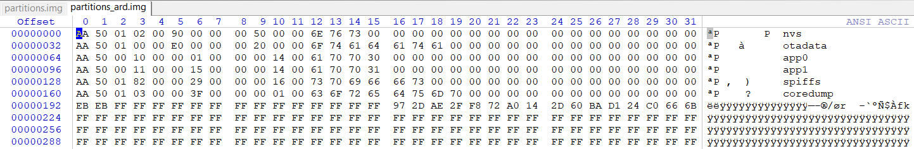

[](https://github.com/x-radio/EEBoom/releases/latest)
[](https://github.com/x-radio/EEBoom/blob/master/LICENSE.txt)
[](https://github.com/x-radio/EEBoom/releases/latest)


# EEBoom
Probably the best way to add emulated EEPROM to your Arduino project:

- easy to use
- extremely low flash memory wear
- any number of independent EEPROM objects
- **ESP32**, **ESP8266** *(**STM32** is planned)*

### Basic example

```cpp
struct EE {
    int         devID = 0XEFBEADDA;     //it will be a default value
    short       step;                   //at the first init will be equal to zero
};

EEBoom<EE>      ee;

void setup() {
    ee.begin();                         //will use two default sectors
}

void loop() {
    ee.data.step++;                     //you can do it realy often -
    ee.commit();                        //this case about 340 times per sector!!!
    delay(1000);
}
```

## How it works
We don't erase the entire memory page every time we need to update the data, we write a modified copy to the next available space on the same page.

And only when we run out of space on the current page will we move on to the next page.

Thus:
- data is protected against ***any*** power failures
- physical wear and tear on memory tends to be as low as possible

The sectors are counted from larger to smaller:
```cpp
ee.begin(1000, 3);              //will fill 1000 -> 999 -> 998 -> 1000 -> ...
```




## Where will storage
- **ESP8266** - arduino framework provides one page of flash for EEPROM emulation. For `4MB` this is sector `1019` (total has `1024`). The sectors have a size of `4096 byte`. [Here](https://arduino-esp8266.readthedocs.io/en/3.1.2/filesystem.html) you can see more details.

    If we want to use more than one page, we have to sacrifice the ability to work with *SPIFFS/LittleFS* and *OTA Updates*, since they use the same pages (`1018`, `1017`, ...).

    On the other hand, the library has an option to return to the base sector. To do this, `ee.goZero()` must be called before attempting an update

    By default `ee.begin()` assumes the use of sectors `1019` and `1018` (for `4MB`). But you can always use any configuration - for example `ee.begin(1000, 100)` initializes pages `1000`-`901` for operation.

- **ESP32** - unlike ESP8266 memory is divided into partitions. Partitions have different types and purposes. For more details see [here](https://docs.espressif.com/projects/esp-idf/en/latest/esp32/api-guides/partition-tables.html).

    ESP32 has a built-in solution for data storage - [NVS](https://docs.espressif.com/projects/esp-idf/en/latest/esp32/api-reference/storage/nvs_flash.html) (non-volatile storage). A special partition is allocated for storage, and sectors are formatted in a special way. We won't describe advantages and disadvantages here, we will only say that the versatility of *NVS* library makes it very wasteful.

    All information about partition structure is stored in `partition_table`, which is usually located at `0x8000`. You can download it with the command:
    ```
    esptool.py read_flash 0x8000 0xC00 partition.img
    ```
    There is special software that allows you to convert this image to a text file, but we can also look at it in a regular HEX editor
    
    On the right side you can see the text labels of the partitions. There are 32 bytes allocated for information about each partition. For example, we can see that the partition labeled `nvs` starts from address `0x900` (`00` `90` `00` `00` `00`) and has size `0x5000` (`00` `50` `00` `00` `00`), which corresponds to `5` sectors.

    There are a total of 6 partitions. `spiffs` - for working with file systems, `app0` - current firmware. `app1` - this is where firmware will arrive during *OTA Update*, `coredump` - for framework needs.

    `nvs` - should not be used for storage - various libraries and the kernel may use this area implicitly, which may lead to data loss

    `app1` - a good candidate if you don't plan to use updates

    `spiffs` - we use by default. `ee.begin()` without parameters initiates the last 2 sectors of this partition for storage.

    Worth mentioning is the ability to create *custom* partitions. For example [like this](https://docs.platformio.org/en/latest/platforms/espressif32.html#partition-tables). To initialize the last 10 sectors in a `mypartition` partition, you can call `ee.begin("mypartition", 10)`

## How to use
```cpp
// Includes =================
#include "Arduino.h"                    //no need in Arduino IDE
#include "EEBoom.h"
//---------------------------
EEBoom<int>         ee;                 //just int

ee.begin();
ee.data = 55;
ee.commit();                            //save to flash
//---------------------------
//for more convenience, you can wrap the data in a structure
//note how to set the values for the first zero init run
struct AppParam {
    uint32_t    devID = 0x12345678;
    uint16_t    minSpeed = 10;
    uint16_t    maxSpeed = 60;
    uint16_t    maxTemp = 85;
    uint8_t     lastOffSrc = PWR_BTN;
    uint8_t     arr[10];
    char        ssid[20] = "Empty_SSID";
    char        pass[20] = "Empty_PASS";
};

EEBoom<AppParam>    ee;

ee.begin(1000, 5);                      //5 sectors 1000 -> 996

Serial.println(ee.data.devID);          //get data from our EEPROM

ee.data.devID = getID();                //change from some func
ee.data.maxSpeed = 70;                  //change limits
ee.data.arr[0] = 0x55;

strcpy(ee.data.ssid, "Awesom_SSID");    //new credentials
strcpy(ee.data.ssid, "Strong_PASS");

ee.commit();                            //don't forget to save it to flash
//---------------------------
#define FIRST_SECT      1000
#define NMB_SECT        3
ee.begin();                             //default first sector, 2 sectors
ee.begin(NMB_SECT);                     //default first sector, 3 sectors
ee.begin(FIRST_SECT, NMB_SECT);
ee.begin("app1");                       //last 2 sectors of app1 partition
ee.begin("mypartition", 10);            //last 10 sectors of custom partition

//esp8266 default first sector = total secrots - 5 (4MB - 1019)
//esp32 default first sector - last spiffs sector
//---------------------------
//If you're using OTA Update you can go back to your home sector
ee.goZero();                            //go to first ee sector
tryOTA();                               //go OTA
//---------------------------
struct BadAligned {
    short       varShort;               //2 bytes
    int         varInt;                 //4 bytes
    char        varCh;                  //1 bytes
};                                      //so total 7? No, this case 12 bytes

struct GoodAligned {
    int         varInt;
    short       varShort;
    char        varChar;
}                                       //total 8 bytes

#pragma pack(push, 1)                   //some directives
struct BadAligned {
    short       varShort;
    int         varInt;
    char        varCh;
};                                      //total really 7 bytes
#pragma pack(pop)                       //try reducing the data structure

// Some tools ===============
ee.setPort(Serial);                     //you need provide desired port
ee.printInfo();                         //some info about current EE object
ee.printInfo(1);                        //commit interval in minutes
//   ↓  ↓  ↓
// User data size: 64                   //real data struct size
// Whole slot size: 68                  //user data + crc + dummy bytes
// First sector: 1019                   //base sector
// Sector count: 20                     //more sectors - longer life
// Slots per sector: 60                 //how many slots on a sectore
// Current sect: 1019                   //where is current slot
// Approximate flash life: 8333 days    //well not bad for a minute-by-minute commit.
//---------------------------
ee.setPort(Serial);                     //you need provide desired port
ee.dump(Sect,                           //desired sector (-1 for current)
        FirstLine,                      //first line (-1 for current)
        NumbLine,                       //number of lines (each is 32 bytes)
        FirstColumn,                    //first from the left column (total 32)
        NumbColumn);                    //number of columns

ee.dump(1000, 0, 4, 0, 22);
//   ↓  ↓  ↓
// Sector 1000:
// 000: DE AD BE EF 00 00 00 00 00 00 14 ED DE AD BE EF 01 00 00 00 00 00
// 001: 00 00 B2 45 DE AD BE EF 03 00 00 00 00 00 01 F2 DE AD BE EF 04 00
// 002: 05 00 00 00 00 00 9F 4A FF FF FF FF FF FF FF FF FF FF FF FF FF FF
// 003: FF FF FF FF FF FF FF FF FF FF FF FF FF FF FF FF FF FF FF FF FF FF
ee.dump();                              //equal ee.dump(-1, -1, 3)
ee.dump(1000);                          //entire 1000 sector - 32column x 128line
ee.dump(1000, 5, 10);                   //1000 sector 5-14 lines 32 columns
ee.dump(1000, 5, 10, 10, 10);           //1000 sector 5-14 lines 10-19 columns
//---------------------------
ee.currentSect();                       //returns current sector - like 1000
//---------------------------
ee.setPort(Serial);
ee.begin();
ee.printMsg();                          //can print -> EEBoom init ok
ee.commit();
ee.printMsg();                          //can print -> EEBoom can't write

if(ee.begin() == false) сantInitEE();   //you can check begin() and commit()
//---------------------------
EETool::spiffsLastSector();             //return the sector number like 1023
EETool::app1LastSector();               //you can use it with begin()
EETool::lastSectorByName("mycstmpart"); //return last sector of custom partition
EETool::printRanges(Serial);            //print ranges of spiffs and app1 partitions
//---------------------------
```
## Installation
- The library can be found by the name **EEBoom** and installed through the library manager in:
    - Arduino IDE
    - Arduino IDE v2
    - PlatformIO
- [Download Library](https://github.com/x-radio/EEBoom/releases/latest) .zip archive for manual installation

## Bugs and feedback
If you find bugs, create an **Issue**, or better yet, email [x-radio@bk.ru](mailto:x-radio@bk.ru)

The library is open for improvements and your **Pull Requests**


When reporting bugs or incorrect library operation, be sure to include:
- Library version
- Which MCU is used
- SDK version (for ESP)
- Arduino IDE version
- Whether the built-in examples that use functions and constructs that cause the bug in your code are working correctly
- What code was loaded, how it was expected to work, and how it actually works
- Ideally attach minimal code where the bug is observed.